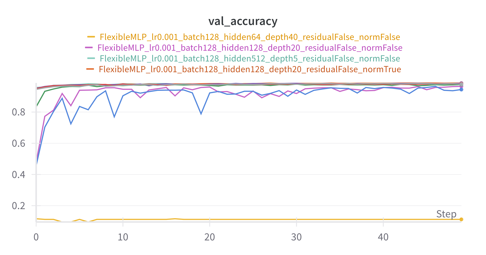
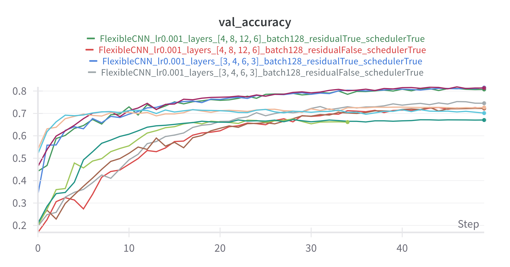

# Deep Learning Architectures & Experiments

This repository contains code for two exercises exploring model design, training, and knowledge distillation on MNIST and CIFAR-10 datasets.

## 📂 Repository Structure

```
├── models/
│   ├── flexible_mlp.py       # FlexibleMLP implementation
│   ├── flexible_cnn.py       # FlexibleCNN implementation
│   └── custom_cnn.py         # Custom CNN variants (BasicBlock, Bottleneck)
├── dataloader.py             # Dataset loaders for MNIST & CIFAR-10
├── exercise1.py              # Main script for MLP/CNN experiments (training, eval, grads)
├── exercise2.py              # Main script for knowledge distillation on CIFAR-10
├── runs/                     # Output directory for model checkpoints & plots
├── requirements.txt          # Python dependencies
└── README.md                 # This file
```

## 🏋️ Exercise 1: FlexibleMLP & FlexibleCNN Experiments

Train and evaluate MLPs and CNNs on MNIST/CIFAR-10 with various depths, widths, normalization, residual connections, and schedulers.

### MLP

MLP validation accuracy, please note that around 20 experiments were made, they can be seen at: https://wandb.ai/niccolo-marini-universit-degli-studi-di-firenze/Lab1_DLA_MLP?nw=nwuserniccolomarini


### CNN

CNN validation accuracy, please note that around 20 experiments were made, they can be seen at: https://wandb.ai/niccolo-marini-universit-degli-studi-di-firenze/Lab1_DLA_CNN?nw=nwuserniccolomarinis


### Usage

```bash
python3 exercise1.py --model FlexibleMLP \
    --epochs 50 \
    --lr 1e-3 \
    --batch_size 128 \
    --hidden_size 128 \
    --depth 20 \
    --residual \
    --norm \
    --scheduler
```

- **Arguments**:

  - `--model`: `FlexibleMLP` or `FlexibleCNN`
  - `--epochs`: # training epochs
  - `--lr`: learning rate
  - `--batch_size`
  - `--hidden_size`: for MLP only
  - `--depth`: # layers for MLP
  - `--layers`: list of 4 ints for CNN blocks
  - `--residual`: enable skip connections
  - `--norm`: enable BatchNorm
  - `--scheduler`: use cosine annealing LR

## 🧪 Exercise 2: Knowledge Distillation on CIFAR-10

Experiment results can be seen at: https://wandb.ai/niccolo-marini-universit-degli-studi-di-firenze/knowledge-distillation-cifar10
Distill a large (teacher) CNN into a smaller (student) one using Hinton et al. 2015.

### Usage

```bash
python3 exercise2.py \
    --data_root ./data \
    --save_dir ./distill_runs \
    --epochs 50 \
    --batch_size 128 \
    --lr 1e-3 \
    --t_layers 3 4 6 3 \
    --s_layers 1 1 1 1 \
    --use_skip \
    --temperature 3.0 \
    --alpha 0.5
```

- **Arguments**:

  - `--data_root`: data folder
  - `--save_dir`: output folder
  - `--epochs`, `--batch_size`, `--lr`
  - `--t_layers`: teacher block counts
  - `--s_layers`: student block counts
  - `--use_skip`: enable teacher residual
  - `--temperature`: distillation temp T
  - `--alpha`: weight for KL vs CE loss

Outputs in `distill_runs/`:

- `teacher.pth`, `student_baseline.pth`, `student_distill.pth`
- WandB logs for losses and accuracies
- Final comparison plots of teacher vs student performance

## 📈 Logging & Visualization

All experiments are instrumented with Weights & Biases (W\&B). Configure your API key:

```bash
wandb login
```

Metrics and model parameters are logged under the project names `Lab1_DLA_MLP`, `Lab1_DLA_CNN`, and `distillation_cifar10`.

### Model Performance Comparison

| Model             | Test Acc (%) | Test Loss |   Params   |
| ----------------- | :----------: | :-------: | :--------: |
| Teacher           |    85.95     |  0.5328   | 20,109,130 |
| Student Baseline  |    82.36     |  0.5386   | 4,737,098  |
| Student Distilled |    85.87     |  0.5672   | 4,737,098  |
| ---               |     ---      |    ---    |    ---     |
| Teacher           |    85.79     |  0.5800   | 23,723,082 |
| Student Baseline  |    81.76     |  0.6031   | 4,735,114  |
| Student Distilled |    85.21     |  0.6733   | 4,737,098  |

_Note: A horizontal rule has been added to visually separate the two experimental runs._

### Brief Observations

1.  **Model Size:** The "Student" models are significantly smaller and more efficient than the "Teacher" models, having roughly **4-5 times fewer parameters**.

2.  **Baseline Performance:** The "Student Baseline" model, when trained on its own, achieves a noticeably lower accuracy than the large "Teacher" model (a drop of ~3-4 percentage points).

3.  **Effectiveness of Distillation:** The "Student Distilled" model successfully closes this performance gap. It achieves an accuracy that is nearly identical to the much larger Teacher model, demonstrating the effectiveness of the knowledge distillation technique.

4.  **Accuracy vs. Loss:** Interestingly, while the "Student Distilled" model has a much better accuracy than the baseline, its test loss is higher. This is a common outcome in knowledge distillation, as the model is optimized to match the teacher's output probabilities, not just to minimize its own classification loss.

## 📚 References

- Hinton, Vinyals & Dean. _Distilling the Knowledge in a Neural Network_, NeurIPS 2015.
- He, Zhang, Ren & Sun. _Deep Residual Learning for Image Recognition_, CVPR 2016.
- PyTorch documentation: [https://pytorch.org/docs/](https://pytorch.org/docs/)
