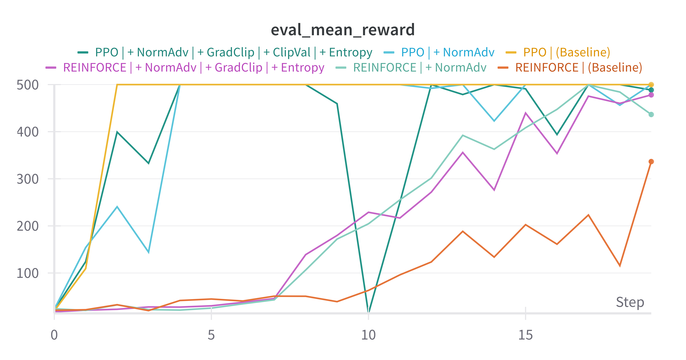
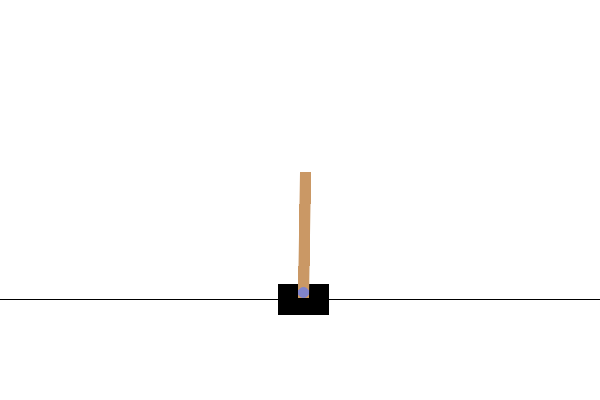
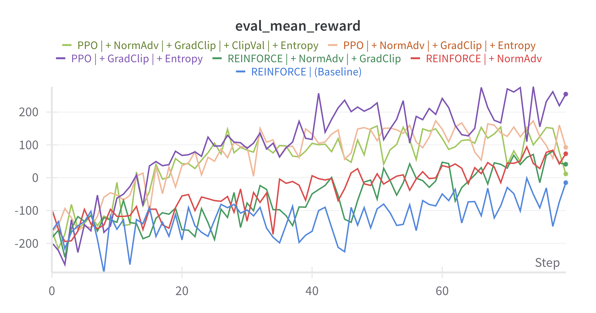
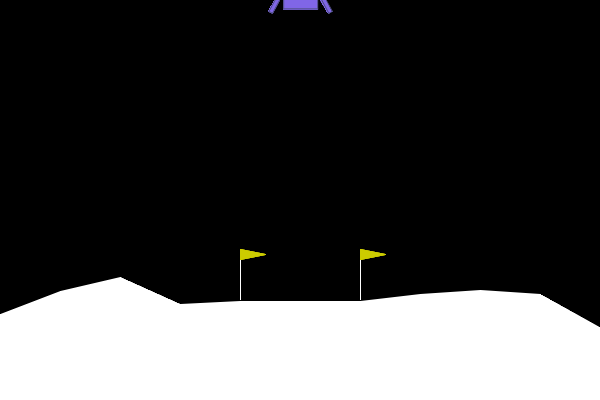

# RL-Algos: REINFORCE & PPO on CartPole & LunarLander

A lightweight reinforcement‑learning pipeline implementing **REINFORCE** and **PPO** on OpenAI Gym environments.  
Out of the box it supports **CartPole‑v1** and **LunarLander‑v2**, with detailed logging (Weights & Biases), GIF creation, and easy CLI control.

---

## 🚀 Features

- **Algorithms**: REINFORCE, PPO
- **Environments**: CartPole‑v1 (discrete), LunarLander‑v2 (discrete)
- **Deterministic vs. stochastic** evaluation (`--deterministic` flag)
- **Temperature** control for exploration
- **Weights & Biases** logging (config, rewards, losses, eval metrics)
- **GIF utility** to record rollouts
- **Bash script** for batch experiments

---

## 📋 Requirements

- Python 3.8+
- PyTorch
- gymnasium
- matplotlib
- wandb
- imageio
- pygame

Install via:

```bash
pip install torch gymnasium matplotlib wandb imageio pygame

```

## 🛠 Usage

python main.py \
 --algo <reinforce|ppo> \
 --env <CartPole-v1|LunarLander-v2> \
 --episodes 1000 \
 --gamma 0.99 \
 --lr 1e-2 \
 --temperature 1.0 \
 [--deterministic] \
 --log_interval 50 \
 --gif path/to/output.gif

## 🔧 CLI Arguments

```bash
--algo           <str>   (default: reinforce)      # Algorithm to use: “reinforce” or “ppo”
--env            <str>   (default: CartPole-v1)    # Gym environment ID: CartPole-v1 or LunarLander-v2
--episodes       <int>   (default: 1000)            # Number of training episodes
--gamma          <float> (default: 0.99)            # Discount factor γ
--lr             <float> (default: 1e-2)            # Learning rate
--temperature    <float> (default: 1.0)             # Exploration temperature
--deterministic  (flag)  (default: False)           # If set, use argmax actions during evaluation
--log_interval   <int>   (default: 50)              # Episodes between logs & console output
--ppo_epochs     <int>   (default: 4)               # Number of PPO epochs per update (PPO only)
--clip           <float> (default: 0.2)             # Clipping parameter ε (PPO only)
--gif            <str>   (default: policy.gif)      # File path for output GIF

```

# Results
## Results on CartPole-v1

All the experiments are available at: https://wandb.ai/niccolo-marini-universit-degli-studi-di-firenze/rl-ablation-study-CartPole-v1?nw=nwuserniccolomarini




## Results on LunarLander-v3




All the experiments are available at: https://wandb.ai/niccolo-marini-universit-degli-studi-di-firenze/rl-ablation-study-LunarLander-v3?nw=nwuserniccolomarini


