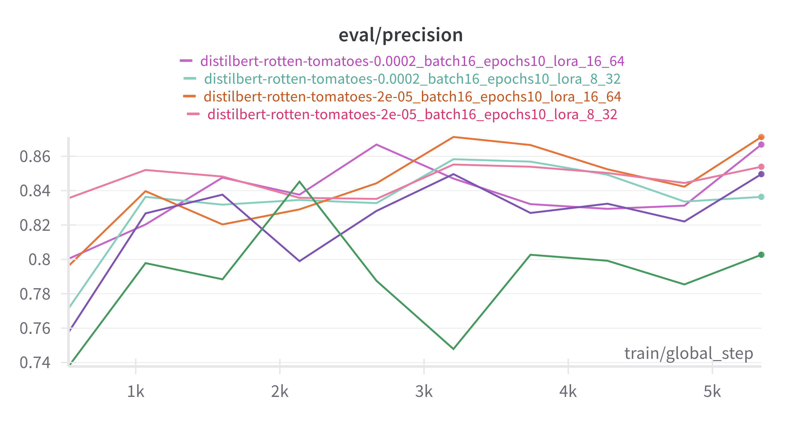
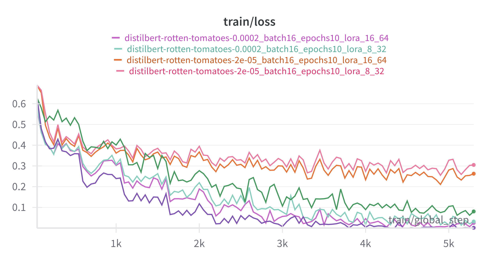
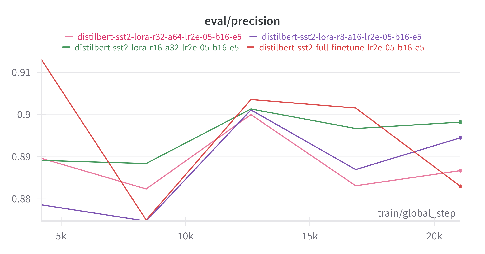

# 📝 Sentiment Analysis with DistilBERT — Full & Efficient Fine-Tuning

This project demonstrates two approaches to fine-tuning [DistilBERT](https://huggingface.co/distilbert-base-uncased) for sentiment classification using the Rotten Tomatoes dataset:

- ✅ **Full fine-tuning** of the model
- ⚡ **Efficient fine-tuning** using [PEFT](https://github.com/huggingface/peft) (Low-Rank Adaptation - LoRA)

Tracking training logs is supported with both **Weights & Biases (wandb)** and **Comet ML** out-of-the-box.

---

## 📦 Installation

```
Required libraries:

    transformers

    datasets

    scikit-learn

    torch

    wandb

    peft

    accelerate

    tqdm

    comet-ml (optional)
```

## 🚀 Usage

Run Full Fine-Tuning

```
python main.py --finetune --wandb --epochs 5 --lr 2e-5 --batch_size 16
```

Run Efficient Fine-Tuning (LoRA)

```
python main.py --finetune --peft --wandb --epochs 5 --lr 2e-4 --batch_size 16
```

Run Baseline (DistilBERT CLS + Linear SVM)

```
python main.py --baseline
```

## 🧪 Model Options

Mode Command Line Description
Full Fine-tune --finetune Fine-tune all parameters of DistilBERT
LoRA (PEFT) --peft Fine-tune only a small number via LoRA
Baseline --baseline Use BERT CLS token features + Linear SVM
⚙️ Configurable Hyperparameters

You can override training configuration directly from the CLI:

python main.py --finetune --epochs 10 --lr 2e-4 --batch_size 32 --wandb

Flag Description Default
--epochs Number of training epochs 3
--lr Learning rate 2e-5
--batch_size Batch size 16
--device cpu or cuda cuda if available
--wandb Enable logging to Weights & Biases Off by default
--peft Use LoRA for efficient fine-tuning Off by default

## 📊 Logging & Monitoring

By default, logs are sent to both:

    Weights & Biases

    Comet ML

To enable wandb logging:

export WANDB_API_KEY=your_key_here

## 📈 Results

More examples can be seen at: https://wandb.ai/niccolo-marini-universit-degli-studi-di-firenze/distilbert-rotten-tomatoes?nw=nwuserniccolomarini



### Key Observations

#### 1. Learning Rate is Critical for Full Fine-Tuning

- The difference in performance for full fine-tuning between a learning rate of `2e-5` (precision: **0.836**) and `2e-4` (precision: **0.792**) is massive.
- **Conclusion**: The higher learning rate (`2e-4`) is too aggressive for full fine-tuning on this dataset, likely causing training instability and leading to a much worse model.

#### 2. LoRA is More Stable and Outperforms Full Fine-Tuning

- At the optimal learning rate of `2e-5`, the best LoRA model (`r=16`, precision: **0.858**) significantly outperforms the best full fine-tuning model (precision: **0.836**).
- Even with the high, unstable learning rate of `2e-4`, LoRA models remained competitive and still outperformed the best full fine-tuning run. This suggests LoRA is more robust to hyperparameter changes.

#### 3. Higher LoRA Rank (`r`) Leads to Better Performance

- In both learning rate scenarios, using `r=16` consistently resulted in better precision than using `r=8`.
  - At `LR=2e-5`: `r=16` (**0.858**) > `r=8` (**0.849**)
  - At `LR=2e-4`: `r=16` (**0.853**) > `r=8` (**0.838**)
- **Conclusion**: For this task, giving the LoRA adapter more capacity via a higher rank was beneficial.

## sst2 Dataset



All the experiments can be seen at: https://wandb.ai/niccolo-marini-universit-degli-studi-di-firenze/distilbert-sst2

🧠 Notes

      Efficient fine-tuning can cut training time and memory use by >90% while maintaining similar accuracy.

      LoRA introduces only a few trainable parameters (~500k) compared to the full 65M in DistilBERT.

      You can easily extend this to other datasets like IMDb, AG News, or SST2.

### Key Observations

#### 1. LoRA Continues to Outperform Full Fine-Tuning

- All LoRA configurations achieved higher final precision than the full fine-tuning model (`0.8829`).
- This confirms that LoRA is not only more parameter-efficient but also a highly effective fine-tuning strategy on this larger dataset.

#### 2. A "Sweet Spot" for LoRA Rank Emerges

- Unlike the `rotten_tomatoes` experiment where a higher rank was always better, here we see a clear peak.
- Performance increased when moving from `r=8` (`0.8945`) to `r=16` (`0.8982`).
- However, performance _decreased_ significantly when moving from `r=16` to `r=32` (`0.8867`).
- **Conclusion**: For `sst2`, `r=16` appears to be the optimal rank. A rank of 32 might be giving the adapter too much capacity, leading to slight overfitting on the training data.

#### 3. More Data Leads to Higher Overall Performance

- The top precision score on `sst2` (**~0.90**) is substantially higher than the top score on `rotten_tomatoes` (**~0.86**).
- This demonstrates the clear benefit of having more training data, as all methods achieved a higher level of performance.

## 📄 License

MIT License
🙌 Acknowledgments

    Hugging Face Transformers

    Hugging Face PEFT

    Weights & Biases

    Rotten Tomatoes Dataset

---
